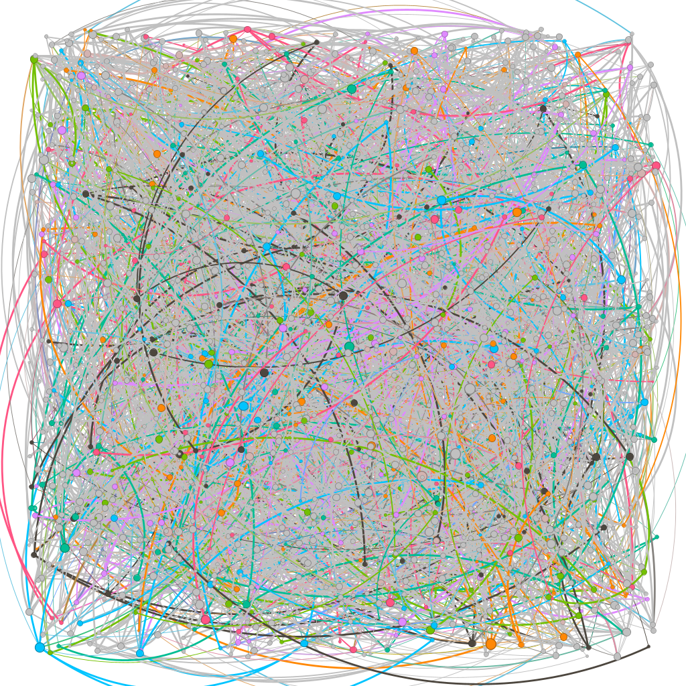

# 202301-CC184-CC41-TF2

Trabajo parcial del curso de Complejidad Algorítmica (2023-01) v2

## Informe

Disponible en [Google Docs](https://docs.google.com/document/d/1ZmKFYGlOkgfngYyZvZKDBm6S1bVG6w7XIwHfKiCbg0k/edit?usp=sharing) o en [GitHub Releases](https://github.com/dalbitresb12/202301-CC184-CC41-TF2/releases).

## Herramientas

- [Python 3](https://www.python.org/)
- [Gephi](https://github.com/gephi/gephi/)

## Directorios

- [`/data`](/data/): archivos de dataset, entre ellos la lista de adyacencia, las aristas y nodos.
- [`/gephi`](/gephi/): el proyecto de Gephi utilizado para renderizar el grafo como una image en base a los archivos del dataset.
- [`/src`](/src/): código en Python utilizado para la generación de datasets y la aplicación.

## Licencia

[MIT](LICENSE)
